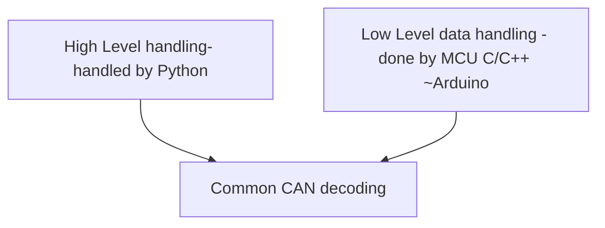

# CAN Message Decoder

## Overview

The CAN Message Decoder project is designed to provide a straightforward solution for hobbyists, student teams, and small-scale projects that require decoding CAN messages. Whether you’re working on a DIY automotive project, a robotics competition, or any other application that involves CAN communication, this project aims to simplify the process of decoding and handling CAN data across both Python and Arduino environments.

## Basic Motivation

The motivation behind this project is to create a common decoding framework that can be used across different layers of a system:

- **High-Level Handling**: Managed by Python for complex data processing, logging, and analysis.
- **Low-Level Data Handling**: Executed by microcontrollers (MCUs) using C/C++ (e.g., Arduino) for real-time data acquisition and initial processing.

## Why is This Important?

For hobbyists and student teams working on car projects or other CAN-based systems, having a unified approach to decoding CAN messages is crucial. Here’s why:

- **Consistency**: Ensures that data interpretation remains consistent across different parts of the system, reducing errors and improving reliability.
- **Ease of Use**: Simplifies the process of defining and managing CAN message formats using a user-friendly JSON configuration.
- **Accessibility**: Makes CAN message decoding accessible without needing specialized tools or deep industry knowledge.

## Current Market Alternatives

### .dbc Files

A common alternative for CAN message decoding in the automotive industry is the use of .dbc files. These files provide a standardized way to describe the data format of CAN messages.

### Limitations of .dbc Files

While .dbc files are powerful and widely used, there are several reasons why they might not be the best fit for hobbyists and student projects:

1. **Complexity**: .dbc files can be overly complex for simpler applications, making them harder to use for beginners.
2. **Tool Dependency**: Working with .dbc files often requires specialized tools and software, which might not be easily accessible or affordable.
3. **Flexibility**: JSON configurations offer greater flexibility and are easier to modify for specific project needs without requiring specialized knowledge or tools.
4. **Universality**: JSON is a universally understood format and can be easily edited and managed using basic text editors, making it more accessible to a broader audience.

## Project Goals

This project aims to provide an open-source, easy-to-use alternative for CAN message decoding:

- **User-Friendly**: Simplify the process of defining and managing CAN message formats using JSON.
- **Cross-Platform**: Ensure compatibility with both Python (for high-level data handling) and Arduino (for low-level real-time processing).
- **Community Driven**: Encourage community contributions and improvements to continuously enhance the project.

## Getting Started

### Prerequisites

- **Python**: Ensure you have Python installed on your system. You will need the `json` module.
- **Arduino**: Install the Arduino IDE and ensure you have the `ArduinoJson`, `SD`, and `FlexCAN_T4` libraries installed.
- **Hardware**: An Arduino-compatible board (e.g., Teensy 4.1) with an SD card module.
